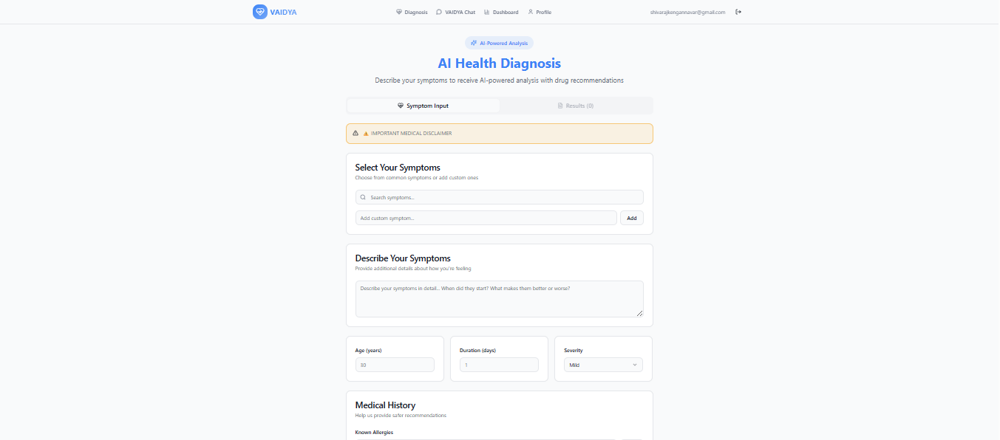

# VAIDYA 

**An AI-Powered Medical Diagnosis and Healthcare Assistant Platform**

VAIDYA is a comprehensive healthcare application that leverages artificial intelligence to provide medical diagnosis assistance, drug recommendations, and personalized healthcare guidance. Built with modern web technologies and designed to make healthcare more accessible and intelligent.

## Project Showcase

### Application Screenshots

<div align="center">

#### Homepage


#### Login Page


#### Dashboard


#### Diagnosis Page


#### Profile Page


</div>

### Demo Video

<div align="center">

#### Complete Application Demo

🎥 **VAIDYA Platform Demo** (2:11 minutes)

**📹 Download Options:**
- [📥 Download Compressed Video (2.44MB)](assets/videos/demos/VAIDYA-compressed.mp4)
- [📥 Original High-Quality Video (56.5MB)](https://github.com/ShivarajNKengannavar/VAIDYA---Disease-Prediction-Drug-Recommendation/releases/download/v1.0/VAIDYA.mp4)

---

*The compressed video (2.44MB) is optimized for quick download. For the best viewing experience, watch on YouTube or download the high-quality version.*

</div>

## Features

### Core Functionality
- **AI-Powered Diagnosis**: Advanced symptom analysis and preliminary diagnosis suggestions
- **Drug Recommendations**: Intelligent medication suggestions based on symptoms and conditions
- **Virtual Assistant**: Interactive healthcare assistant for medical queries
- **Personal Dashboard**: Comprehensive health tracking and insights
- **User Profiles**: Personalized healthcare profiles with medical history
- **📊 Personal Dashboard**: Comprehensive health tracking and insights
- **👤 User Profiles**: Personalized healthcare profiles with medical history

### Advanced Features
- **📸 Media Upload Support**: 
  - Upload photos and screenshots of medical reports, prescriptions, or lab results
  - Video upload support for symptom demonstrations or medical consultations
  - Image analysis for extracting medical information
- **🔐 Secure Authentication**: Protected routes with user authentication
- **📱 Responsive Design**: Optimized for desktop, tablet, and mobile devices
- **🌙 Dark/Light Mode**: Comfortable viewing in any lighting condition
- **📈 Health Analytics**: Visual representations of health data and trends

## 🛠️ Technology Stack

### Frontend
- **React 18** - Modern UI framework with hooks and concurrent features
- **TypeScript** - Type-safe development experience
- **Vite** - Lightning-fast build tool and development server
- **React Router** - Client-side routing with protected routes
- **React Query (TanStack Query)** - Server state management and caching

### UI Components & Styling
- **Tailwind CSS** - Utility-first CSS framework
- **Radix UI** - Unstyled, accessible component primitives
- **shadcn/ui** - Beautiful, accessible component library
- **Lucide React** - Consistent icon system

### Backend & Database
- **Supabase** - Backend-as-a-Service with:
  - PostgreSQL database
  - Real-time subscriptions
  - Authentication system
  - File storage for media uploads
  - Edge functions for serverless logic

### Form Handling & Validation
- **React Hook Form** - Performant forms with easy validation
- **Zod** - TypeScript-first schema validation
- **Hookform Resolvers** - Seamless integration with validation libraries

### Data Visualization
- **Recharts** - Composable charting library for health analytics
- **Embla Carousel** - Accessible carousel component for media galleries

## 📦 Installation & Setup

### Prerequisites
- Node.js (v18 or higher)
- npm, yarn, or bun package manager
- Git

### Clone and Install
```bash
# Clone the repository
git clone <your-repository-url>
cd VAIDYA

# Install dependencies
npm install
# or
yarn install
# or
bun install
```

### Environment Setup
1. Create a `.env.local` file in the root directory
2. Add your Supabase configuration:
```env
VITE_SUPABASE_URL=your_supabase_url
VITE_SUPABASE_PUBLISHABLE_KEY=your_supabase_publishable_key
VITE_SUPABASE_PROJECT_ID=your_project_id
```

### Database Setup
1. Set up a Supabase project at [supabase.com](https://supabase.com)
2. Run the provided SQL migrations in the `supabase/` directory
3. Configure authentication providers as needed

### Development Server
```bash
# Start development server
npm run dev
# or
yarn dev
# or
bun dev

# Application will be available at http://localhost:5173
```

## 🚀 Usage

### Getting Started
1. **Sign Up**: Create a new account with your email and password
2. **Complete Profile**: Add your medical history and preferences
3. **Start Diagnosis**: Navigate to the diagnosis page to begin

### Media Upload Features
VAIDYA supports comprehensive media uploads for enhanced diagnosis:

#### Supported File Types
- **Images**: JPEG, PNG, GIF, WebP, SVG
- **Videos**: MP4, WebM, OGG
- **Documents**: PDF (for medical reports)

#### Upload Methods
1. **Drag & Drop**: Simply drag files into the upload area
2. **Click to Browse**: Use the file picker to select files
3. **Paste from Clipboard**: Paste screenshots directly (Ctrl+V / Cmd+V)

#### Use Cases for Media Uploads
- **Medical Reports**: Upload lab results, X-rays, or test reports
- **Prescriptions**: Share current medications with the AI assistant
- **Symptom Videos**: Record and upload videos demonstrating symptoms
- **Skin Conditions**: Upload photos of rashes, moles, or other visible symptoms
- **Medication Photos**: Take pictures of medicine bottles for identification

### Main Features

#### 🏠 Home Page
- Overview of available services
- Quick access to diagnosis and assistant
- Health tips and educational content

#### 🔍 Diagnosis Page
- Symptom input with intelligent suggestions
- Media upload for supporting evidence
- AI-powered preliminary diagnosis
- Drug and treatment recommendations

#### 🤖 Assistant Page
- Chat interface for medical queries
- Context-aware conversations
- Upload medical documents for analysis
- Personalized health advice

#### 📊 Dashboard Page
- Health metrics and trends
- Appointment tracking
- Medication reminders
- Historical diagnosis data

#### 👤 Profile Page
- Personal information management
- Medical history
- Uploaded media gallery
- Privacy settings

## 🏗️ Project Structure

```
VAIDYA/
├── public/                 # Static assets
├── src/
│   ├── components/        # Reusable UI components
│   │   ├── ui/            # shadcn/ui components
│   │   ├── layout/        # Layout components
│   │   ├── auth/          # Authentication components
│   │   └── forms/         # Form components
│   ├── pages/             # Page components
│   ├── hooks/             # Custom React hooks
│   ├── contexts/          # React contexts
│   ├── lib/               # Utility functions
│   ├── integrations/      # External service integrations
│   └── types/             # TypeScript type definitions
├── supabase/              # Database migrations and functions
├── dataset/               # Training data and models
├── model/                 # ML model files
└── Training/              # Model training resources
```

## 🔧 Development Commands

```bash
# Development
npm run dev              # Start development server
npm run build            # Build for production
npm run build:dev        # Build for development mode
npm run preview          # Preview production build

# Code Quality
npm run lint             # Run ESLint
npm run type-check       # Run TypeScript checks

# Database
supabase start           # Start local Supabase
supabase db reset        # Reset database
supabase db push         # Push migrations
```

## 📊 Data & Models

### Training Data
- **Training.csv**: Comprehensive medical dataset for model training
- **Drug.csv**: Drug information and recommendations database
- **Dataset/**: Additional medical data and resources

### Machine Learning
- **Model/**: Trained models for diagnosis and recommendations
- **Training/**: Model training scripts and configurations
- **Drug Recommendation.ipynb**: Jupyter notebook for drug recommendation analysis

## 🔒 Security & Privacy

- **HIPAA Compliance**: Designed with healthcare privacy standards in mind
- **Data Encryption**: All sensitive data is encrypted at rest and in transit
- **Secure Authentication**: JWT-based authentication with secure session management
- **Privacy Controls**: Granular privacy settings for user data
- **Audit Logs**: Comprehensive logging of all data access and modifications

## 🌐 Browser Support

- Chrome (latest 2 versions)
- Firefox (latest 2 versions)
- Safari (latest 2 versions)
- Edge (latest 2 versions)

## 📱 Mobile Support

VAIDYA is fully responsive and works seamlessly on:
- iOS devices (Safari browser)
- Android devices (Chrome browser)
- Tablets and other mobile devices

## 🤝 Contributing

We welcome contributions to improve VAIDYA! Here's how you can help:

1. **Fork the repository**
2. **Create a feature branch**: `git checkout -b feature/amazing-feature`
3. **Commit your changes**: `git commit -m 'Add amazing feature'`
4. **Push to the branch**: `git push origin feature/amazing-feature`
5. **Open a Pull Request**

### Development Guidelines
- Follow TypeScript best practices
- Use the existing component library (shadcn/ui)
- Write meaningful commit messages
- Add tests for new features
- Ensure accessibility standards are met

## 📝 License

This project is licensed under the MIT License - see the [LICENSE](LICENSE) file for details.

## 📁 Media Upload Guide

### Where to Store Images and Videos

For your VAIDYA project, you have several options for handling media uploads:

#### Option 1: Supabase Storage (Recommended)
```bash
# Media files are automatically stored in Supabase Storage
# Access via: https://your-project.supabase.co/storage/v1/object/public/media/
```
- **Pros**: Scalable, secure, integrated with authentication
- **Use Case**: User-uploaded content (medical reports, screenshots, videos)

#### Option 2: Public Assets Folder
```bash
public/
├── images/
│   ├── logos/
│   ├── icons/
│   └── demo/
└── videos/
    └── demos/
```
- **Pros**: Fast loading, version controlled
- **Use Case**: Static assets (logos, demo images, tutorial videos)

#### Option 3: Cloud Storage (AWS S3, Cloudinary)
- **Pros**: CDN, advanced processing, analytics
- **Use Case**: Large-scale applications with heavy media usage

### Implementation Example
```typescript
// For user uploads (Supabase)
const uploadFile = async (file: File) => {
  const { data, error } = await supabase.storage
    .from('medical-media')
    .upload(`${userId}/${Date.now()}-${file.name}`, file);
  
  return data;
};

// For static assets
import logoImage from '/assets/images/logos/vaidya-logo.png';
```

## 📸 GitHub Media Upload Guide

### Step-by-Step Instructions

#### 1. Create Asset Directories
```bash
# Create the asset structure
mkdir -p public/assets/{images/{screenshots,logos,ui},videos/{demos,tutorials}}
```

#### 2. Add Your Media Files
```bash
# For screenshots
cp /path/to/your/screenshot.png public/assets/images/screenshots/

# For videos
cp /path/to/your/demo.mp4 public/assets/videos/demos/
```

#### 3. Commit and Push to GitHub
```bash
# Add all assets
git add public/assets/

# Commit with descriptive message
git commit -m "Add project screenshots and demo videos"

# Push to GitHub
git push origin main
```

#### 4. Use in README.md
```markdown


[](/assets/videos/demos/demo.mp4)
```

### GitHub File Size Limits
- **Images**: Up to 25MB per file
- **Videos**: Up to 100MB per file (recommended: keep under 50MB)
- **Repository total**: No strict limit, but performance may degrade with many large files

### Best Practices for GitHub Uploads

#### Screenshots
- **Format**: PNG for UI, JPEG for photos
- **Size**: Keep under 2MB per screenshot
- **Resolution**: 1920x1080 or lower
- **Compression**: Use tools like TinyPNG or ImageOptim

#### Videos
- **Format**: MP4 with H.264 encoding
- **Size**: Keep under 50MB for better loading
- **Length**: Under 2 minutes for demos
- **Compression**: Use HandBrake or similar tools

#### Alternative for Large Files
If your files are too large for GitHub:
```markdown
# Use GitHub Releases for large files
📹 [Watch Demo Video](https://github.com/username/repo/releases/download/v1.0/demo.mp4)

# Use external hosting
🎥 [Demo on YouTube](https://youtube.com/watch?v=your-video-id)
```

### Quick Commands
```bash
# Optimize images (requires imagemagick)
mogrify -resize 1920x1080 -quality 85 public/assets/images/screenshots/*.png

# Compress videos (requires ffmpeg)
ffmpeg -i input.mp4 -c:v libx264 -crf 28 -preset slow output.mp4

# Check file sizes
du -h public/assets/images/screenshots/*
du -h public/assets/videos/demos/*
```

## 📞 Contact

**Email**: shivarajnkengannavar@gmail.com 
**Portfolio**: [https://shivaraj.dev  ](https://shivarajnkengannavar-portfolio.vercel.app/)

**LinkedIn**: https://www.linkedin.com/in/shivarajkengannavar/  
**GitHub**: https://github.com/ShivarajNKengannavar

Built with ❤️ using React, TypeScript, and cutting-edge web technologies

© 2026 Shivaraj N Kengannavar. All rights reserved.

## 🆘 Support & FAQ

### Common Issues

**Q: Media uploads are failing**
A: Check your file size limits and ensure you're using supported file formats (JPEG, PNG, MP4, etc.)

**Q: Diagnosis results seem inaccurate**
A: VAIDYA provides preliminary suggestions only. Always consult with qualified healthcare professionals for medical advice.

**Q: How do I delete my uploaded media?**
A: Navigate to Profile > Media Gallery and use the delete option. Note that deleted files cannot be recovered.

## 🚨 Important Medical Disclaimer

**VAIDYA is an AI-powered assistant designed to provide preliminary medical information and should NOT be used as a substitute for professional medical advice, diagnosis, or treatment.**

- Always seek the advice of qualified healthcare professionals for medical concerns
- Do not disregard professional medical advice based on information from VAIDYA
- In case of medical emergencies, contact emergency services immediately
- The platform is for informational purposes only and does not establish a doctor-patient relationship

## 🗺️ Roadmap

### Upcoming Features
- [ ] **Real-time Video Consultations**: Connect with healthcare providers via video
- [ ] **Wearable Integration**: Sync data from fitness trackers and health devices
- [ ] **Multi-language Support**: Expand to support multiple languages
- [ ] **Advanced AI Models**: Implement more sophisticated diagnostic algorithms
- [ ] **Prescription Management**: Digital prescription tracking and reminders
- [ ] **Appointment Scheduling**: Book appointments with healthcare providers
- [ ] **Health Insurance Integration**: Connect with insurance providers for seamless care

### Future Enhancements
- [ ] **Voice Recognition**: Voice input for symptoms and queries
- [ ] **AR/VR Support**: Augmented reality for anatomy education
- [ ] **Blockchain Integration**: Secure medical record management
- [ ] **AI-powered Health Coaching**: Personalized wellness recommendations

---

**Built with ❤️ by Shivaraj N Kengannavar**

*Last updated: January 2026*
